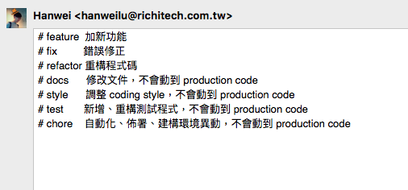
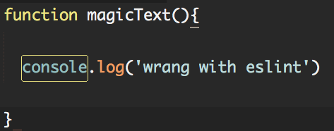

# CBD - 模組開發 (Pseudo)

因為專案對 "文字" 的操作很頻繁，基於 "不重工" 的原則  
你決定開發一個 Magic Text 模組造福大眾~

## Git: Clone & Branch
[Call your mentor]

- 目錄說明

```
magicText/
    - dist/
        - index.html # 專案操作
        - ... (其它無需異動)
    - src/  
        - magictext.js # 模組實作
    - CHANGELOG # 異動記錄
    - .eslintrc # 程式規範 config
    - .gitignore # 忽略版控 config
```

- 實作
    - clone 此 exam project
    - 建立 "js-training" 的分支 (接下來的項目皆於此分支進行)

## 一、Namespace

- 專案操作

```html
<div id="result"></div>

<script>  
  var text = 'hello world';
  
  text = magicText.replaceSpace('-', text) // return "hello-world"

  text = magicText.upperCase(text) // return "HELLO-WORLD"

  magicText.render('result', text)
</script>
```

- 模組實作
  - replaceSpace: 取代文字中的空白
  - upperCase: 將文字轉大寫
  - render: 將文字插入至指定 html ID 中 `<div id="result">HELLO-WORLD</div>`
  - 實作需使用到 Closure

- 關鍵字: "JS 命名空間" 、 "JS 閉包"

## Git: Tag
[Call your mentor]

- 實作
    - push 上述完成的結果
    - 加上 remote tag "namespace"
    - 接下來的項目完成後，也要在 remote 加上 tag 喔~ (ex "constructor"...)

## 二、Constructor

- 專案操作

```html
// ...略

<script>
  var magicText = new MagicText('hello world');

  text = magicText.replaceSpace('-') // return "hello-world"

  text = magicText.upperCase() // return "HELLO-WORLD"

  magicText.render('result')
</script>
```

- 模組實作
    - 在結果不變的前提下，如何讓專案使用物件化方式操作

- 關鍵字: "JS 建構式"


## Git: Commit Template
[Call your mentor]

```
# feature:  加新功能
# fix:      錯誤修正
# refactor: 重構程式碼
# docs:     修改文件，不會動到 production code
# style:    調整 coding style，不會動到 production code
# test:     新增、重構測試程式，不會動到 production code
# chore:    自動化、佈署、建構環境異動，不會動到 production code
```
- 實作
    - Git commit message 自動帶入樣版，方便 Commit 分類



## 三、Chaining

- 專案操作

```html
// ...略

<script>
  var magicText = new MagicText('hello world');

  magicText
    .replaceSpace('-')
    .upperCase()
    .render('result')
</script>
```

- 模組實作
  - 如何調整才能讓專案使用鏈式調用

- 關鍵字: "JS 鏈式調用"

## Git: Merge & Rebase
[Call your mentor]

- 實作
    - 使用 Git Merge 更新遠端內容
    - 使用 Git Rebase 更新遠端內容

- 有什麼不一樣？


## 四、Require

- 專案操作

```html
// ...略
<script>
require([
    'Magic-Text'
], function(MagicText){
     
    // 以下操作和上一個練習相同
   var magicText = new MagicText('hello world');
    
   magicText
        .replaceSpace('-') 
        .upperCase() 
        .render('result');
})
</script>
```

- 模組實作
    - 將 magicText 模組 改為 AMD 格式
    - 專案使用 require 載入 magicText 模組
    - 其它操作方式不變

- 關鍵字: "RequireJS" 、 "AMD 模組"
- 工商服務: [也可以參考這裡](http://124.219.79.141/mapCore/v2/book/advanced/using_require.html)

## ESLint
[Call your mentor]

- 實作
    - 加入 ESLint "no-console" warn 規則


> 有 console.log 的文字出現時，編輯器應有所提示

## 五、Callback

- 專案操作 - index.html

```js
// ...略 

function myRender(demo){
  alert(demo)
}

var magicText = new MagicText('hello world');

magicText.load('demo.html', myRender)
```

- 模組實作
    - 新增 load API，讓專案可載入外部檔案
    - 在載入完成後，會執行 myRender 的函式

## Minify
[Call your mentor]

- 實作
    - 使用 npm 套件，壓縮你的 magicText.js
    - 檔案會自動產生 magicText.min.js 至 dist/ 下

## 六、Promise

- 專案操作

```js
// ...略

function myRender(){
    // alert demo.html 內容
}

var text = new magicText();
text
  .load('demo.html')
  .then(myRender)
});
```

- 模組實作
    - 將上述實作改寫為 promoise 的方式

- 關鍵字: "JS Promise" 、 "jQuery Deferred"

## Bower
[Call your mentor]

- 實作
    - 讓專案能使用 bower 下載你的模組
 
- 你可能會用到 `bower init` 指令
- 專案操作可以 [參考這裡](http://124.219.79.141/mapCore/v2/book/advanced/bower.html)